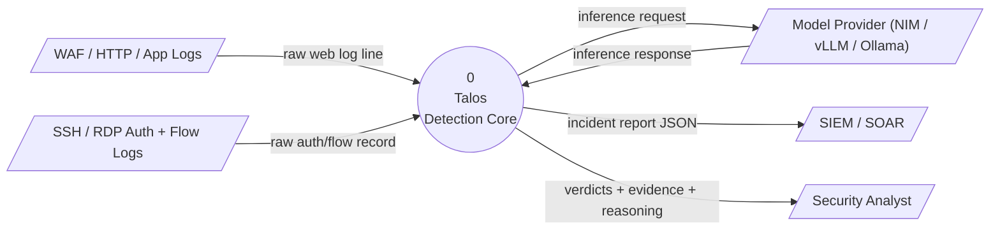
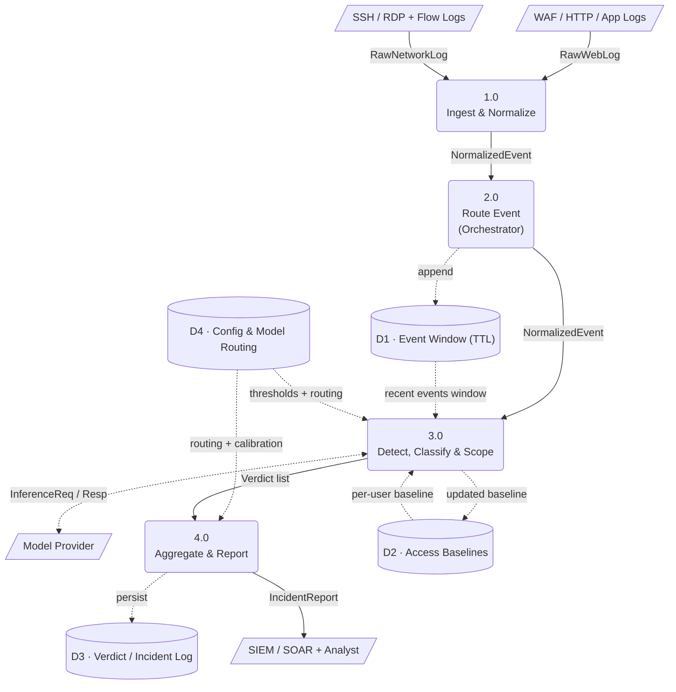
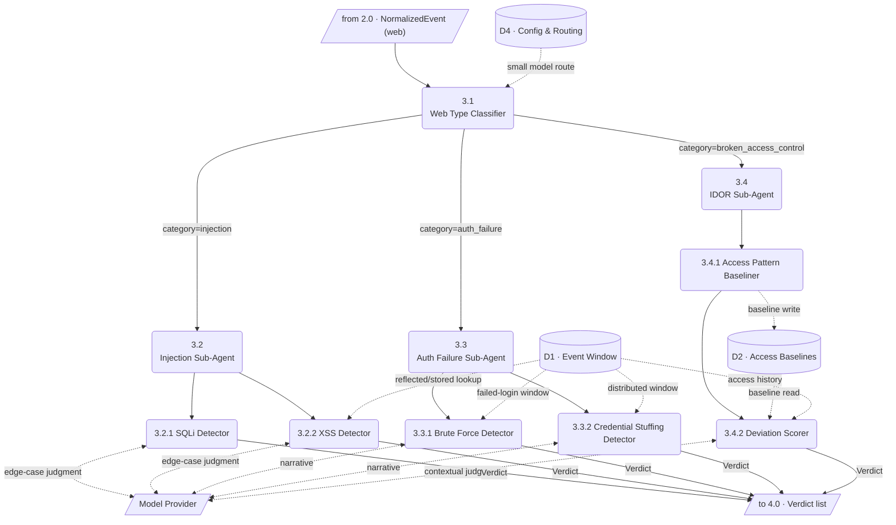
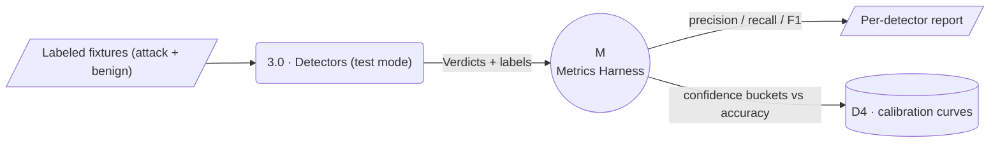

# Talos — Data Flow Diagram (DFD)

**Project:** Talos — Open-Source Multi-Agent System for Attack Detection, Classification, and Scope Analysis
**Document type:** Data Flow Diagram (leveled: Context / Level 0 → Level 1 → Level 2)
**Companion documents:** `Talos_HLD.md`, `Talos_LLD.md`, `Talos_Architecture_Diagram.svg`
**Notation:** Yourdon/DeMarco style. **External entity** = rectangle, **Process** = rounded node (numbered), **Data store** = cylinder (`Dn`), **Data flow** = labeled arrow. Data compositions use the data-dictionary notation in §7 (`=` composed of, `+` and, `[a|b]` select-one, `{x}` iteration, `(y)` optional).

---

## 1. Diagram Index
| Level | Diagram | Decomposes |
|---|---|---|
| Context | §2 | The whole system vs. the outside world |
| Level 1 | §3 | Process 0 → processes 1.0–4.0 + data stores D1–D4 |
| Level 2a | §4 | Process 3.0 (web detection) → 3.1–3.4 |
| Level 2b | §5 | Process 3.0 (network detection) → 3.5–3.6 |

---

## 2. Context Diagram (Level 0)

Talos as a single process, showing every external entity and the top-level data flows crossing the system boundary.



**Boundary summary**
| Flow | Direction | Composition (see §7) |
|---|---|---|
| raw web log line | in | `RawWebLog` |
| raw auth/flow record | in | `RawNetworkLog` |
| inference request / response | out/in | `InferenceRequest` / `InferenceResponse` |
| incident report JSON | out | `IncidentReport` |
| verdicts + evidence | out | `{Verdict}` |

---

## 3. Level 1 — System Decomposition

Process 0 expands into four processes and four data stores.



**Level 1 process notes**
| Proc | Name | Responsibility | In → Out |
|---|---|---|---|
| 1.0 | Ingest & Normalize | parse raw telemetry into the common schema | `RawWebLog`/`RawNetworkLog` → `NormalizedEvent` |
| 2.0 | Route Event | route by `domain`; append event to window | `NormalizedEvent` → `NormalizedEvent` (+ D1 write) |
| 3.0 | Detect, Classify & Scope | classify category, confirm + scope via sub-agents | `NormalizedEvent` (+ D1/D2/D4/model) → `{Verdict}` |
| 4.0 | Aggregate & Report | dedupe, merge scope, score severity, emit report | `{Verdict}` → `IncidentReport` (+ D3 write) |

---

## 4. Level 2a — Process 3.0 for the Web Domain

Decomposes web detection. The classifier (3.1) selects exactly one downstream sub-agent process (3.2 / 3.3 / 3.4).



**Level 2a primitive processes**
| Proc | Detector | Reads | Emits | Technique / MITRE |
|---|---|---|---|---|
| 3.2.1 | SQL Injection Detector | payloads + SQLI patterns (D4) | `Verdict` | `sql_injection` / T1190 |
| 3.2.2 | XSS Detector | payloads + window (D1) | `Verdict` | `xss` / T1059.007 |
| 3.3.1 | Brute Force Detector | failed-login window (D1) | `Verdict` | `brute_force` / T1110 |
| 3.3.2 | Credential Stuffing Detector | distributed window (D1) | `Verdict` | `credential_stuffing` / T1110.004 |
| 3.4.1 | Access Pattern Baseliner | event + baseline (D2) | updated baseline → D2 | (support, no verdict) |
| 3.4.2 | Deviation Scorer | baseline (D2) + history (D1) | `Verdict` | `idor` / T1083, T1530 |

---

## 5. Level 2b — Process 3.0 for the Network Domain

```mermaid
flowchart TD
    IN[/"from 2.0 · NormalizedEvent (network)"/]
    D1[("D1 · Event Window")]
    D4[("D4 · Config &amp; Routing")]
    MODELS[/"Model Provider"/]
    OUT[/"to 4.0 · Verdict list"/]

    P35("3.5<br/>Network Type Classifier")
    P36("3.6<br/>Network Brute Force Sub-Agent")
    P361("3.6.1 SSH Brute Force Detector")
    P362("3.6.2 RDP Brute Force Detector")

    IN --> P35
    D4 -.->|small model route + thresholds| P35
    P35 -->|category=network_brute_force| P36
    P35 -.->|category=unclassified (port-scan/DDoS reserved)| OUT
    P36 --> P361 & P362
    D1 -.->|failed-auth window by host+account| P361
    D1 -.->|failed-auth window by host+account| P362
    P361 <-.->|narrative| MODELS
    P362 <-.->|narrative| MODELS
    P361 & P362 -->|Verdict| OUT
```

> The Network Brute Force detectors (3.6.1/3.6.2) share the **same statistical rate engine** as the web Auth Failure detectors (3.3.1/3.3.2) — identical data-flow shape, different telemetry source and key function (`host+account` vs `account`/`source_ip`).

---

## 6. Data Store Catalog

| ID | Store | Written by | Read by | Contents | Retention |
|---|---|---|---|---|---|
| **D1** | Event Window | 2.0 | 3.2.2, 3.3.x, 3.4.2, 3.6.x | rolling recent `NormalizedEvent`s keyed for fast lookup | TTL (seconds–minutes) |
| **D2** | Access Baselines | 3.4.1 | 3.4.2 | per-account `AccessBaseline` (seen object IDs, numeric range, endpoints) | persistent |
| **D3** | Verdict / Incident Log | 4.0 | Analyst / API | full `IncidentReport` + `Verdict`s with evidence (audit trail) | persistent |
| **D4** | Config & Model Routing | (static/admin) | 3.x, 4.0 | thresholds, windows, agent→model routing, calibration curves | static config |

---

## 7. Data Dictionary

Compositions use: `=` is composed of · `+` and · `[a|b]` select one · `{x}` zero-or-more iterations · `(y)` optional. Primitive fields map 1:1 to the Pydantic models in `Talos_LLD.md` §2.

```
RawWebLog        = raw-log-string           /* combined/nginx/JSON/WAF line */
RawNetworkLog    = raw-log-string           /* sshd syslog | rdp event | netflow */

NormalizedEvent  = event_id + timestamp + domain + telemetry_source
                 + Actor + Target + (WebRequest) + (AuthEvent) + raw + meta
domain           = [ "web" | "network" ]
telemetry_source = [ "waf" | "app_log" | "sshd" | "rdp" | "netflow" ]

Actor            = source_ip + (account) + (session_id) + (user_agent)
Target           = (host) + (endpoint) + (resource_id) + (port)
WebRequest       = (method) + (path) + query_params + (body) + headers + (status_code)
query_params     = { key + value }
headers          = { key + value }
AuthEvent        = (protocol) + outcome + (reason)
protocol         = [ "ssh" | "rdp" | "http" ]
outcome          = [ "success" | "failure" ]

Verdict          = verdict_id + {event_id} + detector + domain + category + technique
                 + attack_detected + confidence + MitreMapping + Scope
                 + {Evidence} + reasoning + ModelInfo + created_at
confidence       = real            /* 0.0 .. 1.0, calibrated */
MitreMapping     = technique_id + technique_name + tactic
Evidence         = kind + detail + {reference}
kind             = [ "log_line" | "matched_pattern" | "statistic" | "baseline_deviation" ]
Scope            = {affected_account} + {affected_endpoint} + {affected_object}
                 + {affected_host} + (attempt_count) + (source_diversity)
                 + (succeeded) + (window_start) + (window_end)
ModelInfo        = name + route_reason + used_llm

IncidentReport   = incident_id + created_at + domain + category + summary
                 + severity + confidence + {Verdict} + aggregate_scope
                 + {MitreMapping} + {recommended_action}
severity         = [ "info" | "low" | "medium" | "high" | "critical" ]

InferenceRequest  = model_id + prompt + response_schema + max_tokens + timeout
InferenceResponse = [ structured-json | error ]

AccessBaseline   = account + {seen_object_id} + (numeric_min) + (numeric_max)
                 + { endpoint + access_count } + updated_at
```

---

## 8. Data Flow Catalog (selected)

| Flow | From → To | Composition | Trigger |
|---|---|---|---|
| RawWebLog | Web source → 1.0 | `RawWebLog` | per log line |
| RawNetworkLog | Network source → 1.0 | `RawNetworkLog` | per log line/record |
| NormalizedEvent | 1.0 → 2.0 → 3.0 | `NormalizedEvent` | per parsed event |
| append-to-window | 2.0 → D1 | `NormalizedEvent` | every routed event |
| recent-window | D1 → 3.3.x/3.6.x/3.4.2/3.2.2 | `{NormalizedEvent}` | on detector evaluation |
| baseline-read/write | D2 ↔ 3.4.1/3.4.2 | `AccessBaseline` | on object-access event |
| inference | 3.x ↔ Model Provider | `InferenceRequest`/`InferenceResponse` | on LLM-needed step |
| Verdict | 3.x → 4.0 | `Verdict` | when a detector fires |
| IncidentReport | 4.0 → SIEM/Analyst | `IncidentReport` | when ≥1 verdict aggregated |
| persist-incident | 4.0 → D3 | `IncidentReport` | every emitted report |

---

## 9. Process Specifications (mini-specs, primitive processes)

**1.0 Ingest & Normalize** — For each raw line: autodetect format → map fields → decode payloads once → assign `event_id`/`timestamp` → emit `NormalizedEvent`. On parse failure: skip + increment `parse_error`.

**2.0 Route Event** — `agent = registry.get(event.domain)`; append event to D1; forward to 3.0. No detection logic.

**3.1 / 3.5 Type Classifier** — static short-circuit signals → small-model refine (strict-JSON, one retry) → `(category, confidence)`; below `min_confidence_floor` → `unclassified`.

**3.2.1 SQLi** — decode payloads → match SQLI patterns → if none, halt; if unambiguous, high fixed confidence (no LLM); else code-aware LLM edge-case judgment → infer success (status/response) → scope endpoint/backend → `Verdict`.

**3.2.2 XSS** — match XSS patterns → determine reflected vs stored via D1 lookup → scope accepting endpoint + render targets → LLM only for obfuscated payloads → `Verdict`.

**3.3.1 / 3.3.2 / 3.6.1 / 3.6.2 Rate detectors** — query D1 window by key → count failures vs threshold → detect trailing success → build `RateSignal` → small model renders narrative → `Verdict` (`succeeded` is the key scoping field).

**3.4.1 Baseliner** — update account's `AccessBaseline` in D2 (object IDs, numeric range, endpoints). Emits no verdict.

**3.4.2 Deviation Scorer** — read baseline (D2) + history (D1) → compute deviation features (outside-range, sequential-run, novel-endpoint, rate) → deterministic score → borderline cases to a heavy contextual model → scope exact out-of-pattern objects → `Verdict`. Immature baseline → low-confidence verdict.

**4.0 Aggregate & Report** — dedupe by `(technique, event_ids)` → merge `Scope` → severity from confidence + `succeeded` + category weight → `recommended_actions` from category table → persist to D3 → emit `IncidentReport`.

---

## 10. Metrics Data Flow (validation)

Not part of the live pipeline but a parallel flow for the testing strategy (HLD NFR-2/3, LLD §9/§14):



Each detector is measured against both attack and **benign** traffic so precision is reported alongside recall; calibration buckets feed back into D4 so a 90%-confidence verdict is right ~90% of the time.

---
*End of DFD.*
