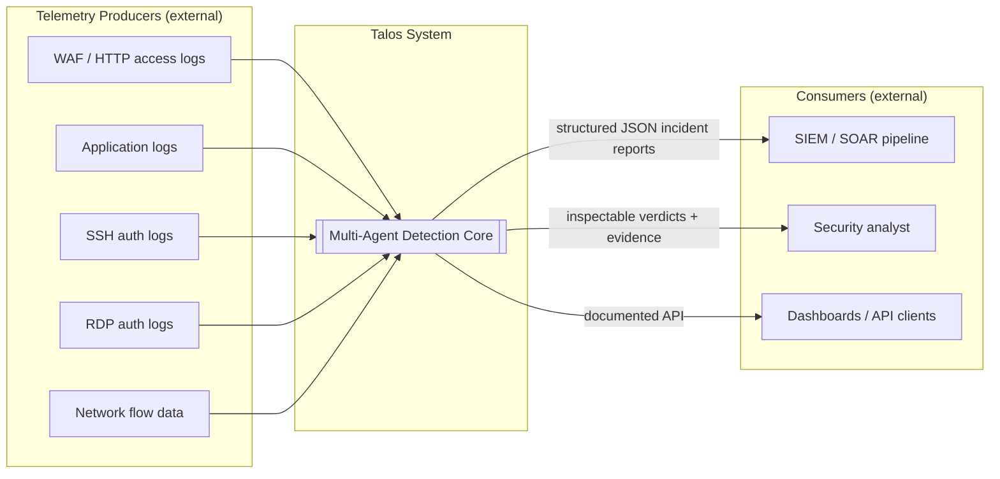
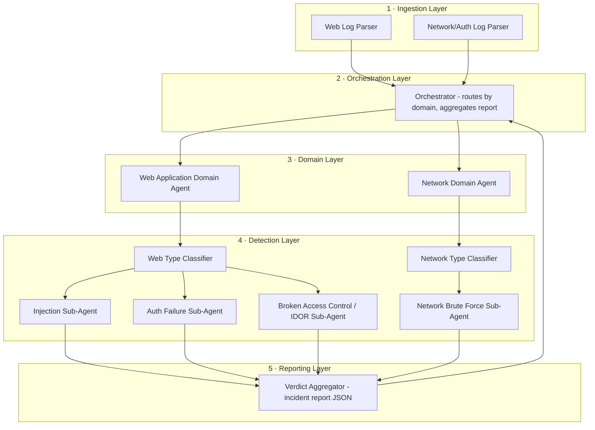
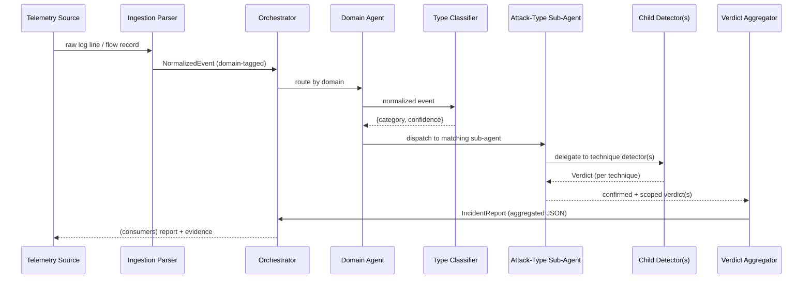
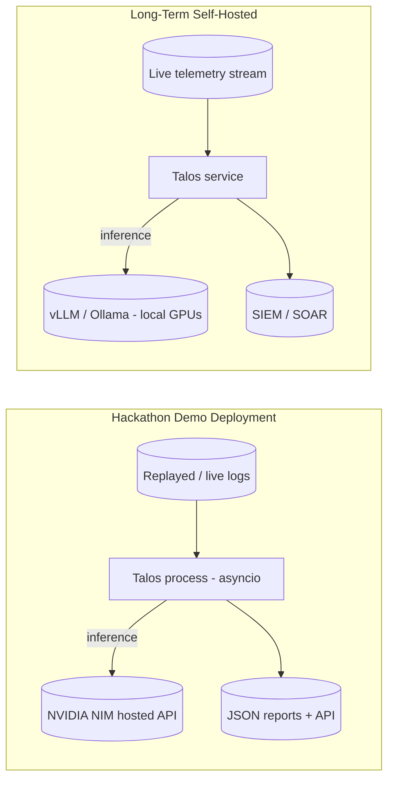

# Talos — High-Level Design (HLD)

**Project:** Talos — Open-Source Multi-Agent System for Attack Detection, Classification, and Scope Analysis
**Document type:** High-Level Design
**Scope of this document:** Hackathon prototype (Web Application + Network domains) with the long-term architecture called out where it shapes near-term decisions.
**Status:** Baseline
**Related documents:** `Talos_LLD.md` (Low-Level Design), `Talos_DFD.md` (Data Flow), `Talos_Architecture_Diagram.svg`, `../submission/Talos_Problem_Statement_and_Solution_Document.md`, `../standards/Talos_Engineering_Standards.md` (repo rules R1–R6), `../planning/Talos_Implementation_Plan.md`

---

## 1. Introduction

### 1.1 Purpose
This document describes the high-level design of Talos: the major building blocks, how they fit together, the runtime flow of a telemetry event from ingestion to incident report, and the cross-cutting principles that govern the whole system. It is intended to be read before the LLD, which drills into per-component internals.

### 1.2 Scope
Talos automates three tasks that dominate an analyst's time when triaging a security alert:

1. **Classification** — precisely identifying *which* attack category and technique produced an event, not just a severity number.
2. **Scoping** — determining *how far* an attack spread: which accounts, endpoints, objects, or hosts were touched, and whether it succeeded.
3. **Transparency** — surfacing the *reasoning and evidence* behind every verdict instead of a single opaque score.

The hackathon build is a **vertical slice** across two domains — Web Application and Network — proving the architecture generalizes. It is deliberately deep on a focused set of categories rather than shallow across many.

### 1.3 Intended audience
Contributors building or extending Talos, judges/reviewers evaluating the design, and security practitioners assessing whether the detection logic is trustworthy.

### 1.4 Definitions
| Term | Meaning |
|---|---|
| **Telemetry** | Live runtime log/flow data emitted by systems under observation (WAF/app logs, SSH/RDP auth logs, flow data). |
| **NormalizedEvent** | The common, domain-tagged event schema produced by ingestion and consumed by every downstream agent. |
| **Agent** | A component that owns a decision boundary (routing, classification, or detection). |
| **Sub-agent** | An agent nested under a domain agent that owns one attack category. |
| **Detector (child)** | A leaf agent that confirms and scopes one specific attack technique. |
| **Verdict** | The structured output of a leaf detector: category, technique, confidence, MITRE mapping, scope, evidence, reasoning. |
| **Incident Report** | The Orchestrator's aggregation of one or more verdicts for a correlated event set. |
| **Scoping** | Establishing the blast radius (affected entities + success/failure) of a detected attack. |

### 1.5 Design references
- **OWASP Top 10** — grounding taxonomy for web categories.
- **MITRE ATT&CK** — technique mapping attached to every verdict (e.g. `T1110` brute force, `T1190` exploit public-facing app).
- **NVIDIA NIM** (`build.nvidia.com`) — hosted, rate-limited open-weight model endpoints for the demo; **vLLM / Ollama** for self-hosting the same weights long-term.

---

## 2. Design Goals and Principles

| # | Principle | What it means concretely |
|---|---|---|
| P1 | **Runtime, not build-time** | Talos consumes *live telemetry*. It is not a CI/CD gate (SAST/SCA/DAST) — those catch flaws before shipping; Talos detects attacks in flight. |
| P2 | **Depth over breadth** | Fewer categories, each genuinely working and tested, over shallow coverage of everything. |
| P3 | **Scoping is first-class** | Every detector answers "how far did it spread / did it succeed," not just "is this suspicious." |
| P4 | **Transparency by default** | Every verdict carries evidence + reasoning + a confidence score, never a bare flag. |
| P5 | **Specialization** | One sub-agent (and one model) per attack shape; each is independently improvable. |
| P6 | **Domain-agnostic core** | The Orchestrator → Classifier → Sub-agent pattern is identical across domains; only parsers and sub-agents differ. |
| P7 | **Community-extensible** | A new attack-type sub-agent can be added via a documented interface **without modifying the Orchestrator**. |
| P8 | **Confidence, calibrated** | Detectors emit probabilities; a 90%-confidence verdict should be right ~90% of the time on labeled data. |
| P9 | **Machine-consumable output** | Structured JSON for SIEM/SOAR, not chat-style prose. |

---

## 3. System Context

Talos sits between telemetry producers and the human/automation layer that acts on incidents.

**External entities**
| Entity | Direction | Interface |
|---|---|---|
| WAF / HTTP / app logs | in | Web log parser (batch/stream) |
| SSH / RDP auth logs, flow data | in | Network/auth log parser (batch/stream) |
| SIEM / SOAR | out | JSON incident report over API / message sink |
| Analyst | out | Human-readable reasoning + evidence embedded in the report |
| Model providers (NIM / vLLM / Ollama) | out (internal dependency) | HTTPS inference API via a model-client abstraction |

---

## 4. Architectural Overview

Talos is organized into **five conceptual layers**. Data flows top-to-bottom; verdicts flow back up to the Orchestrator for aggregation.

### 4.1 Layer responsibilities
1. **Ingestion** — domain-specific parsers normalize raw, heterogeneous telemetry into a single `NormalizedEvent` schema. This is the only place that understands raw log formats.
2. **Orchestration** — the single entry point. Routes each `NormalizedEvent` to the correct domain agent by `domain` tag, tracks the event through the pipeline, and aggregates returned verdicts into one incident report. **No attack-specific reasoning lives here.**
3. **Domain** — one agent per telemetry domain. Owns domain-specific normalization details and hands events to that domain's type classifier.
4. **Detection** — a type classifier picks the likely category; the matching attack-type sub-agent confirms and scopes, delegating to child detectors for distinct techniques.
5. **Reporting** — every leaf detector emits a structured `Verdict`; the aggregator rolls these into a SIEM/SOAR-ready incident report.

---

## 5. Component Descriptions

### 5.1 Orchestrator (top level)
- **Responsibility:** entry point, domain routing, pipeline tracking, verdict aggregation, output exposure (API + JSON sink).
- **Inputs:** `NormalizedEvent` (from ingestion).
- **Outputs:** `IncidentReport` (JSON).
- **Explicitly not responsible for:** detection, classification, or scoping logic — it must remain attack-agnostic so new sub-agents plug in without touching it (P7).

### 5.2 Ingestion Layer
- **Web Log Parser:** parses HTTP access/WAF/app logs → normalizes method, path, query params, body, headers, status, actor (source IP, session, user-agent) into `NormalizedEvent(domain="web")`.
- **Network/Auth Log Parser:** parses SSH/RDP auth logs and flow records → normalizes connection tuples, auth outcome, protocol, targeted account, timing into `NormalizedEvent(domain="network")`.
- For the hackathon, parsers can run in **batch** (replay a captured log file as if live) or **stream** mode; downstream components are agnostic to which.

### 5.3 Domain Agents
| Agent | Consumes | Hands off to |
|---|---|---|
| **Web Application Domain Agent** | `NormalizedEvent(domain="web")` | Web Type Classifier |
| **Network Domain Agent** | `NormalizedEvent(domain="network")` | Network Type Classifier |

### 5.4 Type Classifiers
- **Web Type Classifier:** outputs `{category ∈ {injection, auth_failure, broken_access_control}, confidence}`.
- **Network Type Classifier:** routes to the one built category — `network_brute_force` — with port-scan/DDoS reserved as designed-but-unbuilt roadmap branches.
- Classifiers run on **every event**, so they are the cheapest/fastest model slots.

### 5.5 Attack-Type Sub-Agents and Child Detectors
| Sub-agent | Domain | Child detectors | Detection shape |
|---|---|---|---|
| **Injection** | Web | SQL Injection Detector, XSS Detector | Pattern/signature + LLM edge-case judgment |
| **Authentication Failure** | Web | Brute Force Detector, Credential Stuffing Detector | Statistical rate/frequency |
| **Broken Access Control (IDOR)** | Web | Access Pattern Baseliner, Deviation Scorer | Behavioral baseline + statistical deviation |
| **Network Brute Force** | Network | SSH Brute Force Detector, RDP Brute Force Detector | Statistical rate/frequency (shares core with web Auth Failure) |

> **Deliberate reuse:** the Network Brute Force sub-agent shares its statistical core with the web Authentication Failure sub-agent — same rate logic, different telemetry source. This is the fastest path to a *genuinely* full network category rather than a stub.

### 5.6 Reporting / Output Layer
Every **leaf detector** (not just the Orchestrator) emits a `Verdict` containing: MITRE ATT&CK technique ID, confidence score, scope object, and supporting evidence. The aggregator composes verdicts into an `IncidentReport`.

---

## 6. Runtime Behavior — Event Lifecycle

**Key behaviors**
- **Short-circuit:** if the classifier's confidence is below a configured floor and no sub-agent claims the event, the Orchestrator emits a low-confidence "unclassified" verdict rather than forcing a category.
- **Fan-out:** a single event may be evaluated by more than one sub-agent when the classifier is ambiguous; the aggregator dedupes by `(event, technique)`.
- **Correlation:** rate/behavioral detectors operate over *windows* of events, so the Orchestrator supports stateful sub-agents that accumulate context across events (see LLD §on state).

---

## 7. Data Architecture (high level)

Three canonical schemas span the system (field-level detail in the LLD):

1. **`NormalizedEvent`** — the ingestion output; the contract every agent reads.
2. **`Verdict`** — the leaf-detector output; the contract the aggregator reads.
3. **`IncidentReport`** — the aggregated, SIEM/SOAR-ready output.

**Data stores (hackathon-scale, pluggable):**
| Store | Purpose | Lifetime |
|---|---|---|
| Event window buffer | rolling window of recent events for rate detectors | seconds–minutes (TTL) |
| Per-user access baseline | IDOR baseliner's learned normal access | persistent (per user) |
| Verdict/incident log | audit trail of every verdict + evidence | persistent |
| Model routing config | agent→model map + thresholds | static config |

---

## 8. Model Strategy (high level)

Per-sub-agent model specialization is **architecturally preferred**, not just possible: the Orchestrator already routes by category, so it can route to a different model per sub-agent. Rationale — task fit, cost/latency control, and independent improvability (P5).

| Task profile | Agents | Model tier | Role of the LLM |
|---|---|---|---|
| High-frequency classification | Type Classifiers | small/fast (4–8B) | pick category on every event |
| Pattern/signature (code-aware) | SQLi, XSS | code-aware (Codestral 22B) on a regex/static pre-filter | **edge-case judgment**, not first-line detection |
| Statistical → narrative | Auth Failure, Network Brute Force | smallest (3–4B) | turn a statistical verdict into readable scope; **detection is a threshold, not the LLM** |
| Contextual/behavioral | IDOR Deviation Scorer | large MoE (120B, ~12B active) | weigh a full access history; fewer calls per event |
| Adversarial input screening | payload guard | tiny classifier (86M) | flag prompt injection in log content before a judge model reads it |

**Deployment:** hackathon → hosted free tiers, primarily NVIDIA NIM, with Groq and Mistral as
cross-provider fallbacks; long-term → self-host the same open-weight models. All three providers
speak the OpenAI dialect, so a provider is a base URL plus a key-variable name in config, and a
swap needs no code (LLD §8.1).

**Verified, not assumed.** Every routed model is probed with a live completion before a phase gate
(`scripts/check_model_availability.py`). That check already changed the design once: NVIDIA serves
this account no code-specialist model, so the code tier is led by Mistral's Codestral — see
`../research/Talos_Model_Selection_Research.md`.

---

## 9. Technology Stack (proposed)

| Concern | Choice (hackathon) | Notes |
|---|---|---|
| Language | Python 3.11+ | matches ML/security tooling ecosystem |
| Agent orchestration | in-process async orchestrator (asyncio) | no heavyweight framework needed for the slice |
| Model access | `ModelClient` abstraction over NVIDIA NIM REST | pluggable to vLLM/Ollama by config |
| Static pre-filters | Python `re` / rule tables | deterministic first line for SQLi/XSS |
| Schemas / validation | Pydantic models | enforce `NormalizedEvent` / `Verdict` contracts |
| Output | JSON over REST API (FastAPI) + file/stdout sink | SIEM/SOAR-consumable |
| Test data | OWASP Juice Shop, DVWA, PortSwigger labs, Cowrie honeypot logs | attack + benign traffic |
| Packaging | `pip` package + `docker-compose` demo | community self-host path |

---

## 10. Deployment View

- **Hackathon:** single process, hosted models, replayed telemetry — zero GPU provisioning, fastest path to a working multi-model pipeline.
- **Long-term:** same code, models self-hosted; the project never depends on one vendor's hosted availability.

---

## 11. Cross-Cutting Concerns

| Concern | Approach |
|---|---|
| **Transparency/auditability** | Every verdict persists its evidence + reasoning + model used; nothing is a bare score. |
| **Configuration** | Thresholds, windows, model routing, and enabled sub-agents live in a single declarative config; no code change to tune. |
| **Logging/observability** | Structured logs per pipeline stage; per-sub-agent latency and confidence tracked as metrics. |
| **Error handling** | A failing sub-agent degrades to a low-confidence "inconclusive" verdict; it never crashes the pipeline (fail-open for *detection*, fail-safe for *reporting*). |
| **Model fallback** | If a routed model is unavailable, the `ModelClient` falls back to the configured smaller model and flags reduced confidence. |
| **Tool security** | Talos ingests attacker-controlled data; all payloads are treated as untrusted strings, never executed, and are length-bounded before hitting a model prompt (prompt-injection surface noted in §13). |

---

## 12. Non-Functional Requirements

| ID | NFR | Target (hackathon) |
|---|---|---|
| NFR-1 | Detection latency (event → verdict) | ≤ a few seconds for statistical detectors; classifier sub-second |
| NFR-2 | Precision / recall | reported per sub-agent with F1; benign-traffic pass mandatory |
| NFR-3 | Confidence calibration | 90%-confidence ≈ 90% correct on labeled data |
| NFR-4 | Extensibility | add a sub-agent without editing the Orchestrator |
| NFR-5 | Portability | runs against hosted or self-hosted models via config only |
| NFR-6 | Auditability | 100% of verdicts carry evidence + reasoning |
| NFR-7 | Throughput | handle replayed demo traffic in real time |

---

## 13. Assumptions, Constraints, Risks

**Assumptions**
- Telemetry is available in a parseable form (real logs or replayed capture).
- For the demo there is no live production traffic; Juice Shop/DVWA/Cowrie stand in as realistic sources.

**Constraints**
- Fixed prototype deadline; scope frozen to web + network (see project memory).
- Free-tier hosted model rate limits during the demo.

**Risks & mitigations**
| Risk | Mitigation |
|---|---|
| Hosted model availability / rate limits change | `ModelClient` fallback + open-weight self-host path |
| Prompt injection via attacker-controlled log content | treat payloads as inert data, bound length, never follow instructions inside telemetry |
| Statistical detectors over-fire on benign spikes | mandatory benign-traffic FP testing + tunable windows/thresholds |
| IDOR baseline cold-start (no history yet) | conservative low-confidence verdicts until baseline matures |
| Over-scoping to breadth | governance: new categories require a genuine runtime signature |

---

## 14. Extensibility Model

Adding a new attack-type sub-agent is the primary extension point and must not touch the Orchestrator:

1. Implement the `AttackTypeSubAgent` interface (LLD §interfaces).
2. Register it against a category the relevant Type Classifier can emit.
3. Provide a model-routing entry + thresholds in config.
4. Ship a labeled attack/benign test set for its detectors.

The Orchestrator discovers registered sub-agents at startup; classifiers map categories → sub-agents by registry lookup.

---

## 15. Roadmap (beyond the slice)
- Additional OWASP-aligned web categories with a genuine runtime signature (SSRF next).
- Network: port scanning, DDoS (already designed for in the classifier).
- New domains: cloud (IAM misuse, storage exposure), endpoint (EDR), Active Directory (lateral movement, credential dumping).
- Publish the documented sub-agent interface for community contributions.
- Fine-tune small open-weight models on Talos's own labeled data as usage accumulates.

---

## 16. Requirement → Component Traceability

| Requirement | Realized by |
|---|---|
| Classify attacks precisely | Type Classifiers + attack-type sub-agents (§5.4, §5.5) |
| Scope blast radius | Scope object emitted by every leaf detector (§5.6) |
| Transparent verdicts | Evidence + reasoning + confidence in `Verdict` (§7, §11) |
| Runtime detection | Ingestion of live telemetry (§5.2) |
| Extensible without core edits | `AttackTypeSubAgent` registry (§14) |
| SIEM/SOAR integration | JSON `IncidentReport` output (§5.6, §9) |
| Model specialization | Per-agent routing via `ModelClient` (§8) |

---
*End of HLD.*
